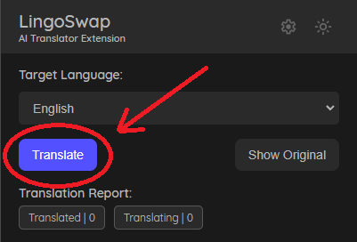

# LingoSwap (Chrome Extension)

An AI-based Chrome Extension that **translates full websites** using Google’s Gemini LLM — while preserving **tone**, **structure**, and **context** far better than traditional machine translators.

## 🛠 Features:

- **Good Quality Translations** (better than Google Translate)
- **Live AI Translation** using Gemini (via your API key)
- **Easy to Use Popup Design** with a sleek dark mode toggle
- **Preserves structure and formatting** (to an extent)

## 🛑 Current Limitations:

- **Dynamic Websites** – Cannot reliably translate sites that dynamically change as you go through.
- **Images** – If the text is in image form, the extension cannot read and translate the text.
- **Translation Quality** – Due to current constraints, although better than normal translators, it is not at the limit of current AI Translations due to it's dependency on Gemini's Free Tier.
- **Non-Standard HTML Structures** – Some websites use unconventional HTML structures which may cause extraction or translation issues, resulting in missing or full cancellation of translation.
- **Large-Scale Websites** – The higher the text count (~500 to ~1000 text elements), the higher the possibility of error, which can result in a translation cancel.
- **AI Related Issues** – The AI itself could return unexpected outputs causing errors in translation.

## 🚀 Get Started:

> NOTE: **This extension is currently in alpha and is purely experimental.** Expect bugs and errors.

### 1. Install The Extension
- Download here! [LingoSwap](nolinkyet) <!-- need a link for this bruh -->

### 2. Get A Gemini API Key
Step By Step:
1. Go to [Google AI Studio](https://aistudio.google.com/app/apikey)
2. Click "Create API Key"
3. Copy the key (keep it private!)
4. Paste the key into the LingoSwap popup > API Key field
5. Click Save
>  Your key is currently stored locally in plaintext, if the key is compromised, please regenerate the key. Encryption coming in future versions.

### 3. Start Translating  
Go to any website → Open the extension → Click **Translate**

## ⚙️ How it works:
1. LingoSwap extracts visible text nodes from any webpage.
2. The text is chunked intelligently and sent to Gemini.
3. Gemini returns natural-sounding translations.
4. The extension injects the translated text back into the site — preserving layout and spacing.

## 👋 Author
Terrarizer – STEM Student & Web Developer

📱 Socials: [GitHub](https://github.com/Terrarizer03) • [X/Twitter](https://x.com/Terrarizer_) • [Ko-fi](https://ko-fi.com/terrarizer) • [YouTube](https://www.youtube.com/@terrarizer3) • [Twitch](https://www.twitch.tv/terrarizer_) 