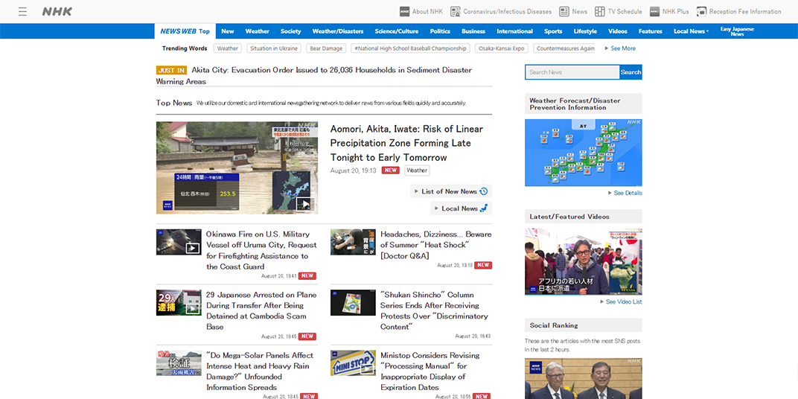

# LingoSwap (Chrome Extension)

An AI-based Chrome Extension that **translates full websites** using Google’s Gemini LLM — while preserving **tone**, **structure**, and **context** far better than traditional machine translators. Created for novel readers, journalists, student researchers, and practically anyone in need of better and more accurate translation quality on websites.

## Version Status:

  

> **This extension is currently in alpha and is purely experimental.** Expect bad code, bugs, and errors.

## Features:

- **Quick, Easy And High Quality Translations** (Better than Google Translate)
- **Live AI Translation** using Gemini (via Your API key)
- **Preserves Structure And Formatting** (To an extent)

## Current Limitations:

- **Dynamic Websites** – Cannot reliably translate sites that dynamically change as you go through.
- **Images** – If the text is in image form, the extension cannot read and translate the text.
- **Translation Quality** – Due to current constraints, although better than normal translators, it is not at the limit of current AI Translations due to its dependency on Gemini's Free Tier.
- **Non-Standard HTML Structures** – Some websites use unconventional HTML structures which may cause extraction or translation issues, resulting in missing or full cancellation of translation.
- **Large-Scale Websites** – The higher the text count (~500 to ~1000 text elements), the higher the possibility of error, which can result in a translation cancel.
- **AI Related Issues** – The AI itself could return unexpected outputs causing errors in translation.
- **No Language Detection** – Due to not implementing language detection, there are no fallbacks for translating a website that's already in the target language.

## Planned Updates & Future Improvements:

**LingoSwap v1.0.0** | Planned Updates/Improvements:

- **Better Code Chunking** – Adding character count to the chunking code for a more fool-proof chunking logic, this can significantly reduce errors, with a trade-off of a slight increase in API calls.
- **Smarter Chunk Prompts** – Chaining memory on chunks by asking for a chunk summary at the end of each output and injecting that summary into the start of the next chunk prompt.
- **Lazy Tab Loading** – Translating only on-screen/can be seen text elements to reduce API calls and improve latency.
- **Auto-Retry Failed Translations** – When a chunk fails, the extension can automatically retry that chunk after a set time.
- **Storage Security** – Storing user-provided API keys more securely.
- **User Selected Fonts** – Adding selectable fonts (in popup) to translated text for cleaner appearance and better user experience.
- **Code Cleanup** – Cleaning up content, pop up and background script for better readability and more efficient update times (due to cleaner code). Things like merging similar functions and refactoring large code into smaller, more manageable code bases.

## Supported Languages

- **Currently Implemented Languages** - LingoSwap has 5 languages implemented into the "Target Language" dropdown, but adding more languages requires no effort as it's just a matter of adding a single line of code for each language in the HTML file.

- **Google's Language Capacity (40+ Languages)** - LingoSwap can translate between languages supported by Google's Gemini AI. While exact numbers aren't officially published (apart from Gemini Live with a confirmed 40+ languages), Google's related AI models support 140+ languages. See [here](https://cloud.google.com/vertex-ai/generative-ai/docs/models).

> **Do Note:** Translation quality still depends on Gemini's training data for each language pair. Major languages typically produce high quality results, while results in lesser known languages may vary.

## Get Started:

### 1. Install The Extension
- Download here! [LingoSwap](nolinkyet) (In Progress...) <!-- need a link for this bruh -->

> While the extension isn't published, you can try it locally! Download the project's zip folder, go to chrome extensions (chrome://extensions), enable Developer Mode, click "Load Unpacked", and select the downloaded zip folder.

### 2. Get A Gemini API Key
Step By Step:
1. Go to [Google AI Studio](https://aistudio.google.com/app/apikey) 
2. Click "Create API Key"
3. Copy the key (keep it private!)
4. Paste the key into the LingoSwap popup > API Key field
5. Click Save
> **WARNING:** Your key is currently stored locally in **plaintext** (no encryption), if the key is compromised, please regenerate the key. Encryption coming in future versions.

### 3. Start Translating  
Go to any website → Open the extension → Click **Translate**

## Example Usage:

Website Used: https://www3.nhk.or.jp/news/

**Untranslated:**

**LingoSwap:**

**Google Translate (For Comparison):**

## How it works:
1. LingoSwap extracts visible text nodes from any webpage.
2. The text is chunked intelligently and sent to Gemini.
3. Gemini returns natural-sounding translations.
4. The extension injects the translated text back into the site — preserving layout and spacing.

## Author
Terrarizer – STEM Student & Developer

- Socials: [GitHub](https://github.com/Terrarizer03) • [X/Twitter](https://x.com/Terrarizer_) • [Ko-fi](https://ko-fi.com/terrarizer) • [YouTube](https://www.youtube.com/@terrarizer3) • [Twitch](https://www.twitch.tv/terrarizer_)

- Contact Me: terrarizer0399@gmail.com